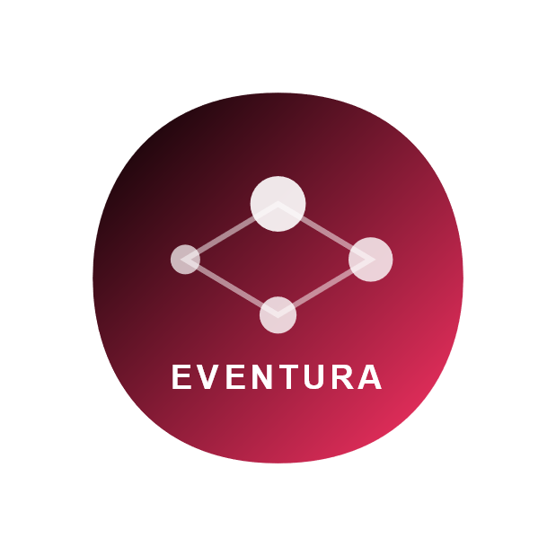

# Projet Tutoré (EVENTURA)



## Auteurs
- TETAH Yacine
- DEKHAIL Youssef
- MORAKEB Chahinez
- EL QODSI Souleimane
- KASDI Cylia

## Description du Projet
Le projet vise à développer une application innovante permettant de gérer les événements, les utilisateurs, et les interactions entre eux. L'objectif principal est de fournir une solution intuitive et efficace pour organiser des événements.

---

## Business Model Canvas
Une analyse approfondie des aspects commerciaux du projet a été réalisée pour identifier les segments de clientèle, les canaux de distribution, et les propositions de valeur.

---

## Diagramme de Cas d'Utilisation
### Acteurs :
- **Utilisateur** : Interagit avec l'application pour consulter et participer à des événements.
- **Organisateur** : Crée et gère les événements.
- **Invité** : Reçoit des invitations et participe aux événements.

### Cas d'Utilisation Principaux :
- Créer, modifier, et répondre à des événements.
- Inviter ou retirer des utilisateurs.
- Accéder à la boutique et acheter des options.

---

## Fonctionnalités Principales
1. Gestion d'événements (création, modification, suppression).
2. Gestion des utilisateurs (invitation, ajout/retrait).
3. Accès à une boutique pour des options supplémentaires.

---

## Conclusion
Ce projet met en avant une approche collaborative et innovante pour simplifier la gestion des événements tout en offrant des fonctionnalités avancées adaptées aux besoins des utilisateurs.

---

## Instructions d'installation
1. Cloner le dépôt :  
   ```bash
   git clone (https://github.com/Narodk1/Projet_tutore.git)
